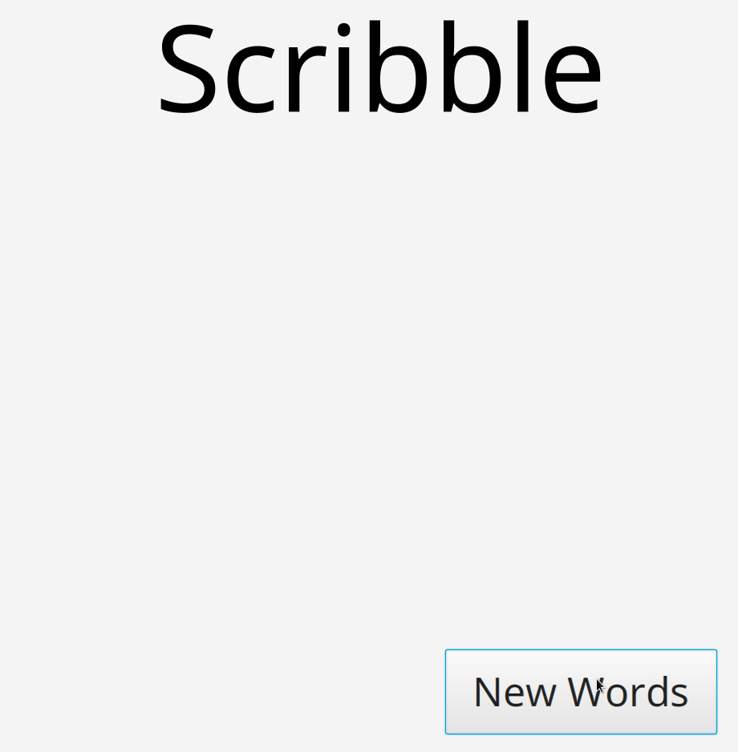

## Execution instructions
First download the JavaFX SDK from [here](https://gluonhq.com/products/javafx/).
```
$ PATH_TO_FX=$(pwd)/javafx-sdk-11.0.2/lib/
$ cd src
$ javac --module-path $PATH_TO_FX --add-modules javafx.controls application/Main.java
$ java  --module-path $PATH_TO_FX --add-modules javafx.controls application.Main
```